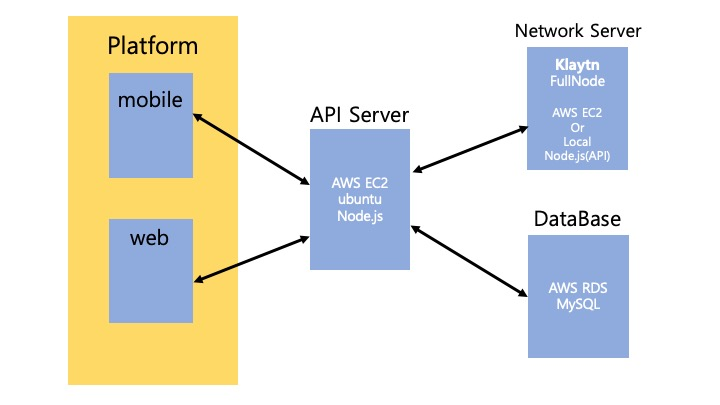

# 청출어람 : 2018 JEJU Blockchain Hackaton - Server

## 블록체인 기반의 온/오프라인 귀농교육 플랫폼

### 1. 프로젝트 소개

### 2. 전체 아키텍쳐

### 3. 청출어람 프로젝트에서 서버백앤드가 갖는 의미와 역할

### 4. API 문서와 소개

- 회원가입
- 강의신청
- 강의등록

### 5. 모바일, 웹 두 가지 플랫폼에 대한 대응

- 사용자 등록
  - 모바일 : 키스토어 파일 등록
  - 웹 : Private Key 등록

### 6. Admin 계정의 역할, 흐름

### 7. 이번 프로젝트에서 Node.js 와 RDBMS를 사용한 이유

### 8. 발생 이슈
